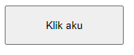
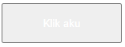
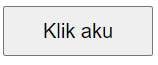

# Percobaan II
## Kode CSS
```css
button{
                width: 150px;
                height: 50px;
                color: white;
                font-size: 20px;
                text-align: right;
            }
```

## Color
### Before


### After


> [!Penjelasan]


## Font-size

### Before


### After



## Text-align

### Before


### After
