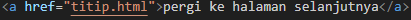

# Pengantar_Web
Web adalah *lorem ipum*
## Daftar materi
1.  Definisi Web
	 Definisi web adalah tempat yang dimana kita bisa mendapatkan informasi.
2.  Protokol Web
	 Protokol Web contoh htttp atau https. 
3.  Tools Web
	 Tools Web contoh Visual Studio Code, Sublime Teks, Notepad++, Dan lain-lain.
## Anggota kelompok
- [x] Agis 
- [x] Fatir
- [x] Daud
- [x] Angga

## Keaktifan
- [x] Angga
- [x] Daud
- [x] Agis
- [x] Fatir


>[! faq]-  Aku dan Teman ku
>Adalah seorang pelajar smkn 7 makassar

  

>[!info]- Web adalah *lorem ipsum* atau tempat untuk mendapatkan atau memberikan informasi
# HTML
Html dimulai dengan tag `<html>` dan di akhiri dengan tag `</html>`
`
# CSS
```html
<!DOCTYPE html>
<html>
	<head>
		<title></title>
	</head>

	<body>
	</body>

</html>
```


Gambar



