# Sturktur dasar
Sturktur dasar html merupakan sebuah struktur yang terdiri dari elemen-elemen dasar yang dimana elemen-elemen tersebut akan membentuk kerangka dokumen html, contoh nya seperti berikut

Contoh:
```html
<!DOCTYPE html>
    <html>
        <head>
            <title>ini adalah judul</title>
        </head>
        <body>
            <p>apapun yang terjadi maka itu terjadi</p>
        </body>
    </html>
```

Penjelasan:
- Tag `<DOCTYPE html>` memberitahu web bahwa dokumen HTML adalah versi 5
- Tag pembuka `<html>` menandai awal sebuah dokumen HTML sampai dengan tag penutup `</html>`
- Tag pembuka `<head>` berisi informasi tentang halaman HTML sampai dengan tag penutup `</head>` ,biasanya dalam tag head terdapat tag `<title>` untuk memberiakan informasi judul halaman HTML
- Apapun tag yang berada di antara tag pembuka `<body>` sampai dengan tag penutup `</body>` akan tampil di web browser.

Hasil:

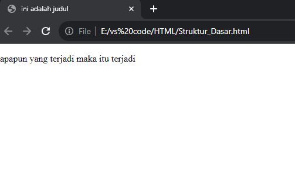
# Anatomi Elemen HTML

## Tag Pembuka dan Tag Penutup
Tag pembuka dan tag penutup merupakan dua bagian dari suatu elemen dalam HTML yang berfungsi sebagai penentu awal dan akhir dari elemen tersebut. Tag pembuka akan dimulai dengan nama elemen yang diapit oleh tanda kurung sudut atau tanda lebih kecil dan tanda lebih besar ("`<`" dan "`>`"). Tag penutup juga hampir sama dengan tag pembuka, akan tetapi tag penutup memiliki karakter garis miring tambahan ("`/`") sebelum nama elemennya. contoh ini, `<a>` adalah tag pembuka, dan `</a>` adalah tag penutup

## Atribut tag

Atribut tag bisanya akan merujuk ke sebuah informasi tambahan tentang elemen html tertentu. bisanya atribut tag akan di sertakan didalam tag pembuka dan akan memberikan nilai khusus kepada elemen tersebut. Atribut berfungsi dalam menentukan dana mengonfigurasi sifat-sifat elemen, seperti warna, tautan, atau ukuran. 

## Isi atau konten tag
Isi atau konten tag biasa akan merujuk pada sebauh informasi yang akan ditempatan di antara dua tag yaitu tag pembuka dan tag penutup. Artinya, isi atau konten dari sebuah tag merupakan sebuah data yang akan ditampilkan atau diolah oleh web browser ketikan halaman html di-render, dan juga isi atau konten tag bisa dapat berupa teks, gambar, hyperlink, atau elemen-elemen html lainnya tergantung pada jenis tag html


Contoh:
```html
<a href="titip.html">pergi ke halaman selanjutnya</a>
```

Penjelasan:
- tag pembuka `<a>` merupakan tag yang di gunakan untuk memasang link di html dan tag penutup `</a>` untuk menutup code nya 
- href merupakan nama atribut yang dimana atribut ini berfungsi untuk menentukan arah atau tujuan link yang di simpan
- "titip.html" merupakan nilai atributnya yang dimana link ini menuju ke file baru yang telah  saya buat yang artinya  "titip.html" adalah tujuan link yang saya simpan
- "pergi kehalaman selanjutnya"merupakan isi konten yang berarti "pergi ke halaman selanjutnya"akan muncul sebagai link yang telah saya tentukan

Hasil:

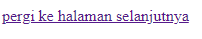

# Tag Dasar

## Heading
Merupakan Tag HTML yang digunakan untuk menunjukkan bagian penting pada halaman website dan memiliki enam tingkatan yang berurutan yaitu H1 hingga H6. Namun setiap tag memiliki fungsi yang berbeda contoh nya 
1. Tag `<h1>` itu seperti topik utama dari sebuah website. Tag `<h1>` merupakan tag yang akan memberi tahu ke google tentang konten halaman tersebut, apa yang ada di dalamnya.
2. Tag `<h2>` sampai `<h6>` sebagai sub-judul, maksudnya seperti ini coba Bayangkan halaman website sebagai sebuah buku. Ketika H1 adalah judul buku, maka H2 sering digunakan dalam _heading_/bab sedangkan H3-H6 sebagai sub-bab.

> [!NOTE]
> Tidak disarankan untuk melompati tiap urutannya, misalnya saat H1 menjadi _heading_ utama, maka _sub-heading_ harus menggunakan Tag H2, tidak boleh langsung melewati ke H3 atau H4.

Contoh
```html
<!DOCTYPE html>
<html>
	<head>
	<title>ini judul</title>
	</head>
	<body>
	<h1>hello world</h1>
	<h2>hello world</h2>
	<h3>hello world</h3>
	<h4>hello world</h4>
	<h5>hello world</h5>
	<h6>hello world</h6>	
	</body>
</html>
```
 

Hasil

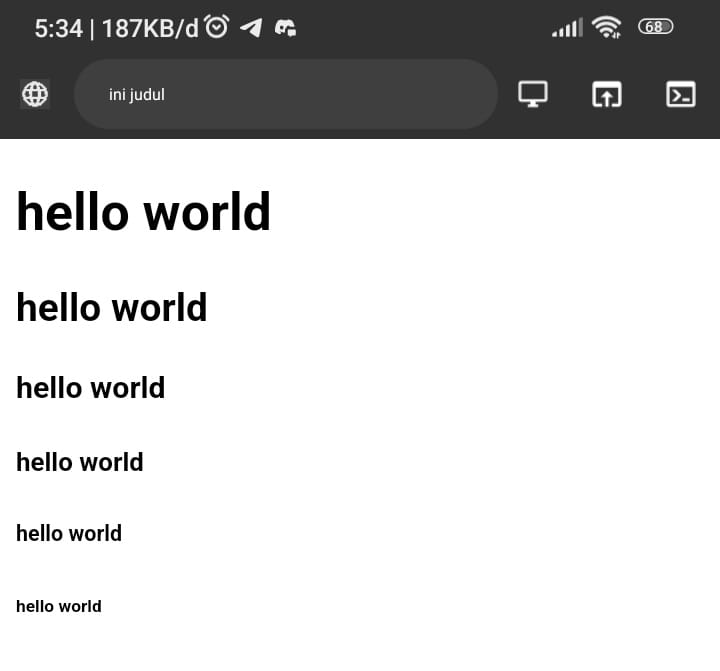
## Paragraf 
Di tag paragraf juga terdapat beberapa tag seperti `<p>`, `<b>`, `<i>`, `<u>`, `<br>`.
- `<p>` tag yang diguanakan untuk menampilkan sebuah paragraf
- `<b>` tag yang digunakan untuk  menebalkan tulisan atau bold
- `<i>` tag yang digunakan untuk memiringkan tulisan atau italic
- `<u>` tag yang digunakan untuk memberikan garis bawah di tulisan atau underline
- `<br>` tag yang digunakan untuk membuat baris baru 
- `<hr>` tag yang digunakan untuk  membuat garis lurus secara horizontal

Contoh
```html
<!DOCTYPE html>
<html> 
	<head>
		<title>ini judul</title>
	</head>
	<body>
		<p>html merupakan kepanjangan dari
		<i>Hyperteks Markup Language</i> dan di buat oleh bapak <b>tim barnes lee</b> yang dimana dia bertujuan untuk menciptakan nya karena <u>untuk berbagi informasi yang dapat dibaca dan diakses melalui web browser</u></p>
		<br>
		<p>www atau world wide web juga dibuat oelh tim barnes lee beserta juga http atau Hyperteks transfer protokol</p>
		<hr>
	</body>
</html>
```


Hasil:

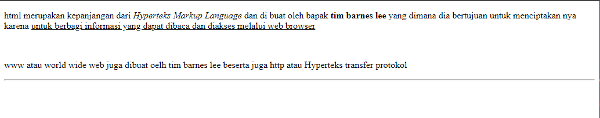

### atribut align
di tag paragraf juga memiliki beberapa atribut yaitu align atribut ini berfungsi sebagai mengatur perataan teks atau paragraf seperti 
- `align="left"` yang dimana  memiliki fungsi untuk megatur teks untuk rata kiri
- `align="right"` yang dimana memiliki fungsi untuk mengatur teks utuk rata kanan
- `align="center"`yang dimana memiliki fungsi untuk mengatur teks untuk rata tengah
- `align="justify"` yang dimana memiliki fungsi untuk mengatur teks untuk rata kiri dan kanan

contoh:
```html
<!DOCTYPE html>
<html>
    <head>
        <title> ini adalah judul</title>
    </head>
    <body>
        <h3>Belajar Menggunakan Elemen Tag html</h3>
        <p align="left">
            Lorem ipsum dolor, sit amet consectetur adipisicing elit. Cumque, adipisci impedit rem numquam labore aut placeat! Accusamus, at nisi ipsum quidem veniam impedit eius culpa ab nemo omnis aliquid. Deserunt!
        </p>
        <p align="right">
            Lorem ipsum dolor sit amet consectetur adipisicing elit. Deserunt, quisquam delectus tempore voluptatem voluptas velit magni minima maxime totam libero aut molestiae, dolores, id provident reprehenderit exercitationem laborum enim necessitatibus!
        </p>
        <p align="center">
            Lorem ipsum dolor sit amet consectetur adipisicing elit. Fugiat quod quaerat ducimus molestiae et incidunt exercitationem consequuntur, impedit delectus, provident deleniti suscipit nemo amet facere veniam magnam quos? Inventore, adipisci!
        </p>
        <p align="justify">
            Lorem ipsum dolor sit, amet consectetur adipisicing elit. Dolorum pariatur quaerat facere totam eos dolores molestiae facilis maxime. Suscipit praesentium porro quas nam est error veritatis tempore debitis, voluptatem commodi.
        </p>
    </body>
</html>
```

hasil

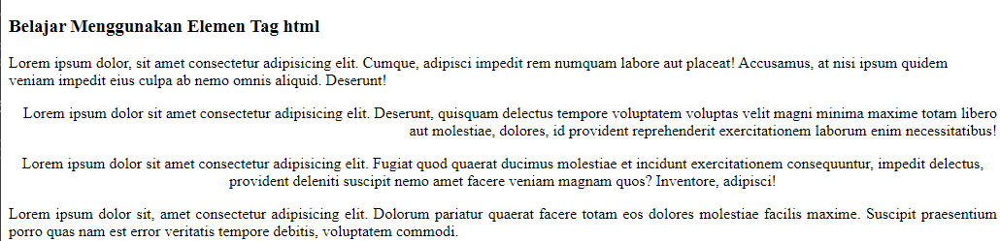

## komentar
HTML juga mempunyai tag khusus untuk komentar untuk membuat komentar di html kita menggunakan awalan  " `<!--` " dan penutup " `-->` ".


contoh 
```html
<!-- ini komentar, tidak akan di tampilkan di browser-->
<p>ini bukan komentar, dan akan tampil di browser</p>
```

hasil

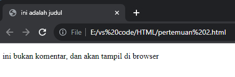

## List
list adalah fungsi di html yang di gunakan untuk menampilkan daftar dari sesuatu. Dalam HTML , tag list terdiri dari 2 jenis, `<ol>` ordered list (berurutan) dan `<ul>` unordered list (tidak berurutan). Ordered list yang akan menampikan angka atau huruf, sedangkan unordered list yang akan menampilkan simbol-simbol seperti simbol bulat atau kotak

contoh
```html
<h1>peralatan XI RPL 1</h1>
       <ul>
        <li>sapu</li>
        <li>meja</li>
        <li>papan tulis</li>
        <li>kipas</li>
       </ul>
 <p>absen XI RPL 1</p>
       <ol>
        <li>ABD.Rahman</li>
        <li>ANUGRAH</li>
        <li>AHSAN</li>
       </ol>
```

hasil

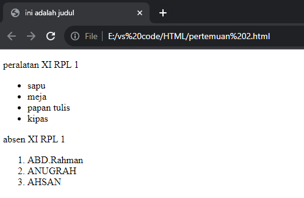

## Link 
link dapat ditemukan di hampir semua halaman web. link/tautan memungkinkan sebuah teks yang ketika di klik akan berpindah ke halaman lainnya. HTML menggunakan tag `<a>` untuk keperluan ini. link ditulis dengan `<a>` yang merupakan singkatan cari anchor(jangkar).


>[!tip] Setiap tag `<a>` setidaknya memiliki sebuah atribut `href` berisi alamat yang dituju.`herf` adalah atribut singkatan dari hypertext reference.

Atribut penting lainnya dati tag `<a>` adalah `target` . Atribut target menetukan tempat untuk membuka dokumen yang ditautkan. Atribut `target` memiliki beberapa nilai salah satunya `_blank` yang berfungsi untuk membuka tautan di tab baru

contoh
```html
<h3>menggunkan tag anchor</h3>
<a herf="https://www.google.com" target="_blank">klik disini untuk ke google</a><br>
<a herf="halaman_selanjutnya.html" target="_blank">klik disini untuk ke halamann selanjutnya
```

hasil

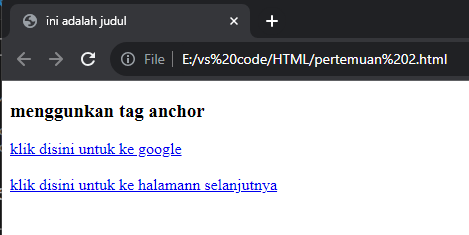

## Multimedia
### Gambar
dalam HTML, gambar didefinisikan dengan tag ``, tag `` adalah tag kosong, hanya berisi atribut saja, dan tidak memiliki tag penutup. Atribut `src` setidaknya mesti dalam tag ini untuk menentukan URL (alamat web) dari gambar yang ingin ditampilkan. Atribut menyediakan teks alternatif untuk gambar, jika pengguna karena beberapa alasan tidak dapat melihatnya (karena koneksi lambat, kesalahan pada atribut `src` , atau jika web browser telah disetting untuk tidak menampilkan gambar). jika dapat menemukan gambar, maka akan muncul nilai pada atribut alt.

Dalam tag `` terdapat juga atribut `width` dan  `height` untuk mengatur ukuran gambar, pada versi HTML 5 standar satuan ukuran gambar adalah pixel

- misalnya dalam folder root terdapat file gambar bernama logo.png. untuk menampilkan gambar tersebut kita hanya perlu mengisi nama gambar beserta jenis ekstensi file gambar kedalam atribut `src` 

contoh
```html

```

Berikut di bawah ini gambar yang mendeskiripsikan letak/lokasi gambar yang disisipkan pada tag di atas, terlihat bahwa file html dalam satu letak penyimpanan yang sama dengan gambar yang dimuat oleh web.
![[ss15.png]]

Hasil

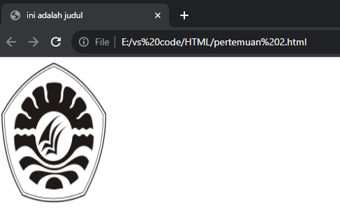

### Video
 dalam HTML, video didefinisikan dengan tag `<video>`, tag `<video>` adalah tag yang digunakan untuk memasukkan video kedalam web, di tag `<video>` terdapat tag khusus yang dimana tag ini tidak memiliki tag penutup yaitu `<source>` yang Digunakan untuk menyediakan beberapa sumber video dan memberi browser pilihan format yang sesuai. 

Dalam tag `<video>` terdapat juga atribut   `controls` yang digunakan untuk Menambahkan kontrol pemutaran standar seperti play, pause, dan volume, dan juga di tag `<video>` ada atribut `width` dan `height` yang digunakan untuk mengatur ukuran video, pada versi HTML 5 standar satuan ukuran video adalah pixel, dan juga di dalam nya juga terdapat atribut `type` yang di gunakan untuk menentukan tipe MIME (Multipurpose Internet Mail Extensions) dari file video yang disematkan.


misalnya dalam folder root terdapat file video bernama video.mp4. untuk menampilkan video tersebut kita hanya perlu mengisi nama video beserta jenis ekstensinya didalamnya atribut `src` lalu kita berikanan atribut `controls` dan berikan atribut `width` dan `height` .
contoh
```html
<video controls src="videoplayback.mp4" width="350x" height="250px"></video>
```


Gambar dibawah merupakan gambar yang mendefinisikan bahwa file html dengan gambar dalam 1 folder

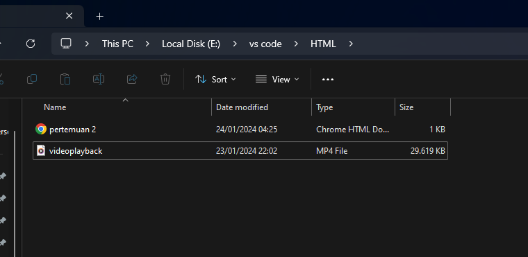

hasil

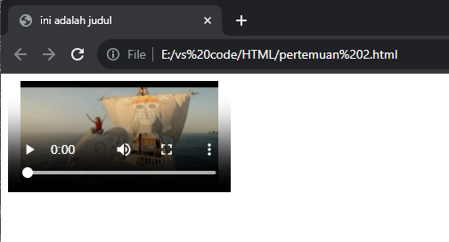


### audio
Di HTML, tag `<audio>` digunakan untuk menyematkan dan memainkan file audio di halaman web. Tag ini memungkinkan pengembang web menyertakan file audio langsung di dalam dokumen HTML, memungkinkan pemutaran langsung di halaman tanpa perlu mengarahkan pengguna ke halaman terpisah atau menggunakan pemutar audio eksternal. di dalam tag `<audio>` juga memiliki atribut yaitu `src` ,  `controls`  yang memiliki fungsi masing masing

- `src` digunakan untuk menentukan URL atau path ke file media yang akan dimainkan.
- `controls` yang digunakan untuk Menambahkan kontrol pemutaran standar seperti play, pause, dan volume.

contoh 

```html
<audio controls src="gomu_gomu_message (1).mp3" type="audio/mp3"></audio>
```

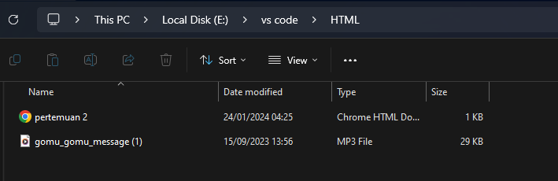

hasil

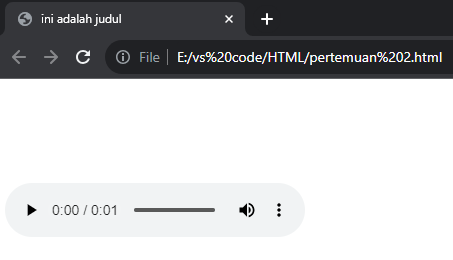

### Halaman Web Lain
Elemen `<iframe>` dapat digunakan untuk menampilkan dokumen html lain dalam sebuah website. Mudahnya, bisa dibilang website dalam website.

>[!tip] Contoh penggunaannya seperti ini. jika kita mempunyai website sekolah, lalu di website tersebut ingin menampilkan alamat alamat dalam google maps sekolah. Agar memudahkan pengunjung website, kita bsia langsung tampilan saja halaman sekolah yang ada di google maps

Dalam tag `<iframe>` ada beberapa atribut yang penting seperti:

- `src` , untuk mencari sumber halaman html atau web yang akan ditampilkan di dalam iframe
-  `width` dan `height` , untuk mengatur ukuran panjang dan lebar dari frame

contoh

```html
<iframe src="https://www.petanikode.com/" width="1300px" height="450px"></iframe>
```

hasil


## Table
Tabel dalam HTML di definisikan dengan `<table>`
- Setiap baris tabel didefinisikan dengan tag `<tr>`
- Header (judul) tabel didefinisikan dengan tag `<th>`. secara default, header tabel memiliki teks tebal dan beraada di tengah
- Data tabel/sel didefinisikan dengan tag `<td>` . Karena sel merupakan bagian terkecil dari tabel maka dari itu tag selalu berada di dalam tag `<tr>` .

### Tabel Latihan 1
contoh
```html
<table border="1">
        <tr>
            <th>no</th>
            <th>NAMA</th>
            <th>asal sekolah</th>
            <th>kelas</th>
            <th>kelamin</th>
            <th>umur</th>
        </tr>
        <tr>
            <td>1</td>
            <td>Ahmad Anugrah Satya </td>
            <td>smk negeri 7 makassar</td>
            <td>XI RPL 1</td>
            <td>laki-laki</td>
            <td>16</td>
        </tr>
        <tr>
            <td>2</td>
            <td>Muh.Agis </td>
            <td>smk negeri 7 makassar</td>
            <td>XI RPL 1</td>
            <td>laki-laki</td>
            <td>16</td>
        </tr>
        <tr>
            <td>3</td>
            <td>Muh.Daud Resky Jayadi </td>
            <td>smk negeri 7 makassar</td>
            <td>XI RPL 1</td>
            <td>laki-laki</td>
            <td>17</td>
        </tr>
        <tr>
            <th>1</th>
            <th>Muh.Nur Resky Alfatir </th>
            <th>smk negeri 7 makassar</th>
            <th>XI RPL 1</th>
            <th>laki-laki</th>
            <th>16</th>
        </tr>
    </table>
```

hasil

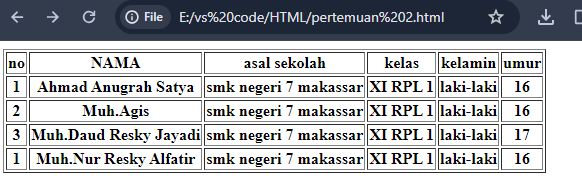

>[!tip] Perhartikan bahwa pada tag `<table>` terdapat sebuah atribut `border`. Atribut border yang digunakan untuk memberikan nilai garis tepi dati tabel, nilai ini dalam ukuran pixel. `border="1"`, berarti kita mengistruksi kepada web browser bahwa tabel tersebut akan memiliki garis tepi sebesar 1 pixel. Jika tidak ditambahkan, secara default tabel tidak memiliki garis tepi. 

### Tabel Latihan 2
Selain itu, terdapat pula beberapa atribut tabel yang penting untuk diketahui yaitu:
- `rowspan` merupakan atribut HTML yang berfungsi untuk mengadakan beberapa baris (ke bawah)
  - `colspan` atau colomn spawn merupakan atribut HTML yang berfungsi untuk menggabungkan beberapa kolom (ke samping)
  - `width` berfungsi untuk mengatur lebar tabel yang nilainya didefinisikan dalam satuan pixel secara default.
  - `height` berfungsi untuk mengatur tinggi tabel yang nilainya didefinisikan dalam satuan pixel secara default.
  - `align` berfungsi untuk mengatur perataan teks padatabel. Nilai atribut yang dapat diberikan yaitu `left` untuk perataan teks ke kiri, `right` untuk perataan teks ke kanan, `center` untuk perataan teks ke tengah.

contoh
```html
<table border="1">
            <tr>
                <th rowspan="2">Nama</th>
                <th colspan="2">Asal Instansi</th>
            </tr>
            <tr>
                <th width="100">Sekolah</th>
                <th width="100">Kampus</th>
            </tr>
            <tr>
                <td>Muh.Daud Resky Jayadi</td>
                <td rowspan="3">SMKN 7 Makassar</td>
                <td rowspan="3" align="center">-</td>
            </tr>
            <tr>
                <td>Muh.Agis</td>
            </tr>
            <tr>
                <td>Ahmad Anugrah Satya</td>
            </tr>
        </table>
```


hasil

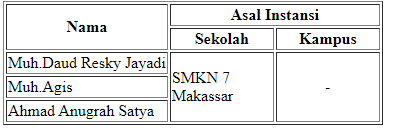


### Tabel Latihan 3
```html
        <table border="1">
            <tr bgcolor="green">
                <th colspan="2" align="center">Nama hari</th>
                <th colspan="2" align="center">Nama bulan</th>
            </tr>
            <tr>
                <td align="center" width="100">senin</td>
                <td align="center" width="100">selasa</td>
                <td align="center" width="100">april</td>
                <td rowspan="2" align="center" width="100">juni</td>
            </tr>
            <tr>
                <td align="center" width="100">rabu</td>
                <td align="center" width="100">kamis</td>
                <td align="center" width="100">mei</td>
            </tr>
        </table>
```

hasil

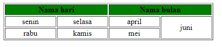
## Form
Elemen `<form>` HTML digunakan untuk mendefinisikan form yang digunakan  untuk mengumpulkan inputan dari penggunaan website. Tag ini digunakan untuk mengoleksi inputan dari user, konsep ini sama seperti konsep formulir di dunia nyata.

>[!tip] dengan kata lain tag `<form>`  merepsentikasikan sebuah "formulir" di mana satu formulir bisa dimiliki banyak kolom isian. 

Form HTML berikan elemen-elemen `form` lainnya. Elemen `<form>` digunakan untuk menampung macam-macam  elemen yang berkaitan dengan sebuah `form`, seperti `text` `fields`, `checkbox`, `radio button`, tombol `submit`, dan  banyak lagi yang dapat diedit kemudian ditulis untuk dikirim pada sebuah server untuk selanjutnya diproses guna mendapatkan informasi tertentu dari atau untuk user.
Umumnya, sebuah website selalu memiliki fitur form, contoh paling umum yang sering kita temui adalah seperti form login, form sign up, form komentar di suatu blog/media.

### Input 
Elemen `<input>` adalah elemen `form`yang paling penting. Elemen `<input>` dapat ditampilkan dalam beberapa cara, tergantung pada nilai atribut `type` yang digunakan. Berikut adalah beberapa contoh nilai dari atribut type: 
- `text` digunakan untuk mengambil isian berupa teks. Contohnya seperti nama. 
- `password` digunakan untuk mengambil isian berupa kata sandi atau sesuatu yang bersifat rahasia. Tipe ini akan mengubah semua karakter yang diketikkan ke dalam karakter bulat. 
- `radio` digunakan sebagai kolom isian bertipe pilihan yang menawarkan beberapa opsi kepada user namun tetapi hanya satu opsi saja yang boleh dipilih. Contohnya seperti jenis kelamin atau agama. 

>[!tip] Perlu diperhatikan bahwa untuk penggunaan tipe `radio` yang berkategori set pilihan yang sama mengharuskan nilai `name` -nya juga sama. 

Opsi default dapat dilakukan dengan menambahkan atribut `checked` pada elemen opsi yang dijadikan sebagai opsi default. 

- `checkbox` digunakan untuk memberikan daftar pilihan dalam satu set opsi. User dapat memilih satu atau bahkan lebih dari satu pilihan pada tipe ini. Hal ini berbeda dengan tipe sebelumnya yaitu `radio` yang hanya memungkinkan user untuk memilih satu pilhan saja. Contoh penggunaan `checkbox` seperti daftar makanan kesukaan, daftar olahraga yang tidak disukai, dan yang semisalnya.

>[!tip] Perlu diperhatikan bahwa untuk penggunaan tipe `checkbox` yang berkategori set pilihan yang sama mengharuskan nilai `name`-nya juga sama.
>

- `number` digunakan untuk membatasi isian user hanya pada karakter numerik saja. Browser akan menambahkan dua buah tombol atas dan bawah untuk mengubah angka isian. 
Beberapa atribut untuk tipe number: 
- `min` - menentukan angka minimal 
- `max` - menentukan angka maksimal 
- `step` - menentukan kelipatan (nilai yang tidak sesuai kelipatan tidak bisa di-input, dan default dari atribut ini adalah 1) 

- `date` digunakan untuk memberikan isian berupa tanggal. Atribut `min`dan `max` dapat pula difungsikan pada tipe ini untuk mengatur tanggal minimal dan tanggal maksimal yang diinginkan. Nilai `min` dan `max` tersebut ditulis dengan format: `YYYY-MM-dd`.
- `file` digunakan untuk memungkinkan pengguna memuat file. Atribut `accept` juga dapat disisipkan pada tipe ini dengan maksud untuk mengatur file apa saja yang boleh di-upload. Beberapa contoh value dari atribut `accept` yaitu: 
- `accept="image/png,image/jpg, image/jpeg"` - untuk file gambar seperti png, jpg, atau jpeg 
- `accept=".pdf` - untuk file pdf
- `accept=".doc, .docx"` - untuk file `doc` atau `docx`
- `accept=".ppt, .pptx"` - untuk file `ppt` atau `pptx`

- `submit` ditampilkan dalam bentuk tombol untuk mengirim data pada `<form>` yang menjadi pembungkusnya. Atribut `value` digunakan untuk mengisi teks yang ingin ditampilkan pada tombol.
- `reset` berguna untuk mengembalikan state (keadaan) atau data dari suatu form ke nilai awalnya. Jika nilai awal sebuah input adalah kosong, maka ketika direset ia akan kembali kosong. Tapi jika nilai awalnya sudah terisi sesuatu, maka ketika direset datanya akan kembali seperti yang sudah diset sebelumnya.
- `button` berguna untuk membuat inputan berupa sebuah tombol. Tombol ini nantinya bisa difungsikan sesuai dengan keinginan dari pengembang web.

### Label
Elemen `<label>` memiliki fungsi khusus untuk melabeli sebuah kolom inputan. Ketika screen reader membaca konten halaman HTML, lalu menemukan sebuah inputan, ia akan membaca label yang bersangkutan. 
Fungsi lain dari tag `<label>` adalah ketika kita mengklik label, maka browser akan meletakkan fokus pada kolom isian yang terhubung dengannya. Syarat yang perlu diperhatikan yaitu dengan menghubungkan sebuah `<label>` dan `<input>` dengan atribut for untuk label, dan atribut id pada `<input>` dengan nilai untuk kedua atribut tersebut mesti sama persis.

### Select
Elemen `<select>` berguna dalam mendefinisikan sebuah tombol dropdown yang dimana user dapat memilih salah satu dari banyak pilihan.

> [!tip] - Elemen `<select>` nantinya berperan sebagai kontainer atau pembungkus dari elemen `<option>` yang berperan sebagai daftar pilihan atau opsi. 

 Elemen `<select>` hampir mirip fungsinya dengan `<input type ="radio">` akan tetapi baiknya elemen `<select>`digunakan untuk memilih satu pilihan yang terdapat banyak opsi di dalamnya, sedangkan `<input type ="radio">` lebih baiknya untuk digunakan jika user diarahkan memilih hanya satu pilihan yang opsi pilihannya tidak terlalu banyak. Contoh penggunaan elemen ini seperti memasukkan pilihan berupa asal daerah atau yang semisalnya.
 
Penting untuk diketahui bahwasanya opsi yang aktif secara default adalah adalah opsi yang pertama. Akan tetapi, kita bisa mengatur opsi mana yang aktif secara default dengan menambahkan atribut selected pada suatu `<option>` yang ingin dijadikan sebagai opsi default.

### Text Area
Elemen `<textarea>` berguna untuk mengambil inputan user berupa teks yang dapat memuat lebih dari satu baris. Jika dibandingkan dengan elemen `<input>` teks biasa, elemen `<textarea>` memiliki ukuran tinggi yang lebih besar. Element `<textarea>` bisa diisi lebih dari satu baris dengan menekan enter.

Atribut yang dapat digunakan untuk mengatur ukuran dari textarea yaitu `rows` untuk jumlah baris, sedangkan atribut `cols` untuk lebarnya.

### Button
Elemen `<button>` yang berada di dalam sebuah form akan otomatis dianggap sama fungsinya seperti `<input type="submit">`. Jika ingin membuat tombol biasa yang tidak men-submit `<form>` dapat dilakukan dengan menambahkan atribut type="button".

Beberapa atribut yang digunakan pada contoh di atas yang perlu untuk diperjelas yaitu sebagai berikut:

- `name` - digunakan sebagai nama variabel yang akan diproses oleh web server (contoh menggunakan PHP)
- `required` - digunakan untuk memastikan bahwa pengguna harus memasukkan nilai pada input tersebut sebelum dapat melakukan proses submit formulir
- `placeholder` - menuliskan teks pada elemen input. Placeholder sangat bermanfaat untuk memberikan teks bantuan kepada user untuk inputan form yang kompleks
- `value` - menentukan nilai awal dari sebuah elemen input
- `disabled` - digunakan untuk menonaktifkan inputan pada elemen yang diberi atribut ini


### Latihan Form 1
```html
<h1>Formulir Pendaftaran</h1>
<form action="">
  <div>
    <label for="nama-lengkap"><b>Nama Lengkap:</b></label>
    <br />
    <input
      type="text"
      id="nama-lengkap"
      name="nama_lengkap"
      placeholder="Masukkan nama lengkap"
      required
    />
  </div>
  <div>
    <label for="password"><b>Password:</b></label
    ><br />
    <input
      type="password"
      id="password"
      name="password"
      placeholder="Masukkan password"
      required
    />
  </div>
  <div>
    <b>Jenis Kelamin:</b><br />
    <input id="lk" type="radio" name="jenis_kelamin" checked />
    <label for="lk">Laki-Laki</label>
    <input id="pr" type="radio" name="jenis_kelamin" />
    <label for="pr">Perempuan</label>
  </div>
  <div>
    <label for="isian-usia"><b>Usia:</b></label
    ><br />
    <input
      type="number"
      id="isian-usia"
      name="usia"
      min="17"
      max="25"
      value="19"
      required
    >
    Tahun
  </div> 
  <div>
    <label for="tgl-ijazah"><b>Tanggal Ijazah:</b></label> <br />
    <input
      type="date"
      id="tgl-ijazah"
      name="tgl_ijazah"
      min="2021-01-01"
      value="2023-06-20"
      required
    >
  </div>
  <div>
    <label for="opsi-agama"><b>Agama:</b></label
    ><br>
    <select id="opsi-agama" name="agama" required>
      <option disabled>---Pilih Agama----</option>
      <option value="islam">Islam</option>
      <option value="kristen">Kristen</option>
      <option value="katolik">Katolik</option>
      <option value="hindu">Hindu</option>
      <option value="buddha">Buddha</option>
      <option value="atheis" disabled>Atheis</option>
    </select>
  </div>
  <div>
    <label for="alamat"><b>Alamat:</b></label> <br />
    <textarea
      id="alamat"
      name="alamat"
      cols="25"
      rows="5"
      placeholder="Harap masukkan alamat secara lengkap"
      required
    ></textarea>
  </div>
  <div>
    <b>Kemampuan Berbahasa Asing:*</b><br />
    <input type="checkbox" id="inggris" name="bahasa_asing" />
    <label for="inggris">Inggris</label>
    <input type="checkbox" id="arab" name="bahasa_asing" />
    <label for="arab">Arab</label>
    <input type="checkbox" id="jepang" name="bahasa_asing" />
    <label for="jepang">Jepang</label>
  </div> 
  <div>
    <label for="isian-foto"><b>Foto 4x6:*</b></label
    ><br />
    <input
      type="file"
      id="isian-foto"
      name="foto"
      accept="image/png,image/jpg,image/jpeg"
    />
  </div>
  <br />
  <input type="submit" value="Kirim" />
  <input type="reset" value="Batal" />
  <i>*opsional (tidak wajib diisi)</i>
</form>
```

Hasil dari program di atas:

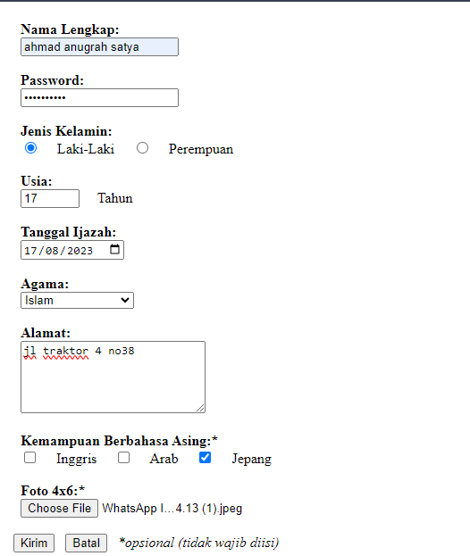

### Latihan Form 2

```html
<form>
            <label for="nama">nama:</label>
            <input type="text" required>
            <br><br>
            <label for="password">password:</label>
            <input type="password" required>
            <br>
            <input type="radio" name="jk">
            <label for="jenis_kelamin">Laki-Laki</label>
            <input type="radio" name="jk">
            <label for="jenis_kelamin">Perempuan</label>
            <br>
            <input type="checkbox" name="web">
            <label for="web">web</label>
            <input type="checkbox" name="mobile">
            <label for="mobile">mobile</label>
            <input type="checkbox" name="desktop">
            <label for="desktop">desktop</label>
            <br>
            <input type="submit" value="kirim">
            <input type="submit" value="ulang">
            <br>
            pesan anda:
            <textarea></textarea>
        <br>
        </form>
```

1. `<form>` tag ini digunakan untuk mengumpulkan inputan dari penggunaan website.
2. `<label>` tag ini merupakan tag yang didalam tag `<form>` yang berfungsi untuk melakukan penginputan di web.
3. `<br>` digunakan untuk membuat baris baru
4. `type` atribut yang digunakan untuk memasukkan jenis/tipe penginputan yang akan digunakan.
5. `for`  untuk membuat `<label>` clickable dan menghubungkannya dengan suatu form elemen (biasanya elemen input ) yang mempunyai `id` yang sama dengan nilai `for`
6. `required` merupakan atribut yang digunakan untuk memberikan sebuah 
7. untuk `nama`, `password`,`jenis_kelamin`, `web`, `mobile`, `desktop` itu merupakan nilai dari sebuah atribut yaitu atribut `for`
8. dan untuk  `text`, `password`, `radio`, `chekbox`, `submit` merupakan nilai dari sebuah atribut yaitu atribut `type`

### Bagaimana Cara Memproses Form?

Ketika sebuah `<form>` disubmit, baik menggunakan elemen `<button>` mau pun `<input type="submit">`, browser akan mengirimkan data tersebut kepada URL yang didefinisikan pada atribut `action` di dalam tag `form`.

Ada pun jika atribut action tidak didefinisikan, maka browser akan menggunakan URL sekarang sebagai tujuan pengiriman data.

```html
**<form** action**=**"/proses-pendaftaran"**>**
...
**</form>**
```

Pada contoh di atas, ketika form di-submit, browser akan mengirimkan data yang ada  menuju URL /proses-pendaftaran.

### Apa yang terjadi pada URL /proses-pendaftaran?

Pada URL tersebut terdapat sebuah aplikasi/program yang berjalan di server (bukan di browser). Tugas dari program tersebut adalah mengelola data yang dikirim seperti misalnya menyimpan data tersebut ke dalam sebuah database. 

Bahasa yang umum digunakan di dalam server adalah python, nodejs, PHP, dan lain sebagainya.

Untuk mendapatkan gambaran lebih jelas, sebenarnya akan dijelaskan pada modul selanjutnya yang berkaitan dengan materi PHP atau juga bisa dengan membaca tutorial berikut:
https://jagongoding.com/web/php/web-dinamis/membuat-dan-menangani-form/

## DIV & SPAN
### `<div>`

### Penjelasan
tag div merupakan tag yang digunakan untuk membuat layer yang dimana itu akan memudahkan seorang devoloper untuk membuat layout sesuai dengan desain yang diinginkan.

### Contoh

```html
 <div>Ini dibuat menggunakan div</div>
 <div>Ini juga menggunakan div</div>
```

### Hasil

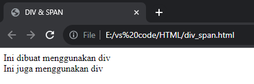

## `<span>` 

### Penjelasan
Mirip seperti DIV, span adalah tag HTML yang tidak punya makna apa-apa ketika berdiri sendiri. Ia berguna untuk memberi aksi atau hiasan pada sebuah atau sekelompok elemen HTML.

### Contoh
```html
<p>Ini dibuat menggunakan tag paragraf, <span>dan ada span di dalamnya.</span></p>
        <span>Ini dibuat menggunakan span</span>
        <span>ini j uga dibuat menggunakan span</span>
```

### Hasil

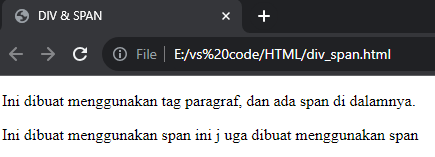
